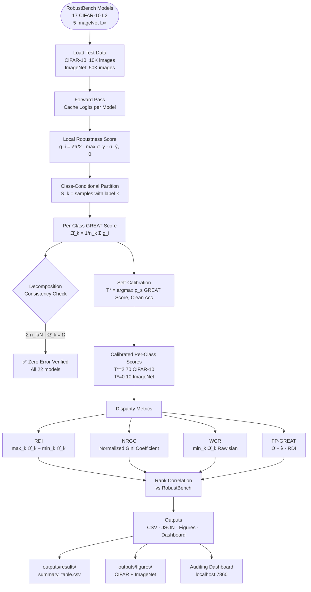

# GF-Score: Certified Class-Conditional Robustness Evaluation with Fairness Guarantees

## Overview

Standard adversarial robustness evaluation reports a single aggregate score — masking the fact that a model can be highly robust on average while being nearly defenseless on specific classes. **GF-Score** (GREAT-Fairness Score) addresses this by decomposing the certified [GREAT Score (NeurIPS 2024)](https://arxiv.org/abs/2304.09875) into per-class robustness profiles and quantifying their disparity through four fairness-aware metrics grounded in welfare economics.

The framework is fully **attack-free**: self-calibration uses only clean accuracy correlations, eliminating the C&W attack dependency of the original paper while achieving equal or better ranking fidelity.

### Key Contributions

- **Exact decomposition** — per-class GREAT Scores reconstruct the aggregate with zero numerical error across all 22 evaluated models
- **Four disparity metrics** — RDI, NRGC, WCR, and FP-GREAT, each capturing a distinct facet of robustness inequality
- **Attack-free self-calibration** — replaces adversarial attack-based temperature tuning with clean accuracy rank correlation
- **Finite-sample guarantees** — formal concentration bounds (Hoeffding + union bound) for per-class estimates and RDI
- **Interactive auditing dashboard** — Gradio interface for post-hoc per-class robustness auditing of any RobustBench model

---

## Pipeline



---

## Results

### Self-Calibration and Ranking Fidelity

Spearman rank correlation (ρ) with RobustBench accuracy rankings:

| Method | CIFAR-10 Uncal. | CIFAR-10 Cal. | ImageNet Uncal. | ImageNet Cal. |
|---|:---:|:---:|:---:|:---:|
| Original GREAT Score | 0.662 | 0.897 † | 0.800 | — ‡ |
| **GF-Score (Ours)** | 0.662 | **0.871** | **0.900** | **1.000** |

> † Uses C&W adversarial attack for calibration.  
> ‡ Calibration not performed for ImageNet in the original paper.

Our attack-free self-calibration matches or exceeds the original method across both benchmarks, with **perfect rank correlation (ρ = 1.000) on ImageNet** — using only publicly available clean accuracies.

---

### CIFAR-10 Results — 17 Models (ℓ₂, ε = 0.5)

| Model | RobustBench Acc. | GREAT Score | RDI | NRGC | WCR | Worst Class | FP-GREAT |
|---|:---:|:---:|:---:|:---:|:---:|:---:|:---:|
| Rebuffi_extra | 82.32% | 0.465 | 0.333 | 0.135 | 0.283 | cat | 0.298 |
| Gowal_extra | 80.53% | 0.480 | 0.348 | 0.138 | 0.288 | cat | 0.306 |
| Rebuffi_70_ddpm | 80.42% | 0.381 | 0.360 | 0.178 | 0.166 | cat | 0.201 |
| Rebuffi_28_ddpm | 78.80% | 0.352 | 0.359 | 0.191 | 0.144 | cat | 0.173 |
| Augustin_WRN_extra | 78.79% | 0.526 | 0.319 | 0.105 | 0.335 | cat | 0.366 |
| Rade_R18 | 76.15% | 0.337 | 0.315 | 0.177 | 0.157 | cat | 0.179 |
| Augustin_WRN | 76.25% | 0.483 | 0.385 | 0.135 | 0.242 | cat | 0.291 |
| Sehwag_Proxy | 77.24% | 0.232 | 0.302 | 0.250 | 0.060 | cat | 0.081 |
| Rebuffi_R18 | 75.86% | 0.302 | 0.326 | 0.193 | 0.121 | cat | 0.139 |
| Sehwag_R18 | 74.41% | 0.186 | 0.248 | 0.258 | 0.054 | cat | 0.062 |
| Wu2020 | 73.66% | 0.105 | **0.111** | 0.194 | 0.047 | dog | 0.049 |
| Augustin2020 | 72.91% | 0.488 | **0.435** | 0.142 | 0.218 | cat | 0.271 |
| Engstrom2019 | 69.24% | 0.126 | 0.234 | 0.327 | 0.024 | dog | 0.009 |
| Rice2020 | 67.68% | 0.117 | 0.200 | 0.309 | 0.031 | dog | 0.017 |
| Rony2019 | 66.44% | 0.222 | 0.275 | 0.225 | 0.096 | cat | 0.085 |
| Ding_MMA | 66.09% | 0.086 | 0.127 | 0.218 | 0.039 | cat | 0.023 |
| Gowal2020 | 74.50% | 0.111 | 0.121 | 0.192 | 0.046 | dog | 0.050 |

**RDI range**: 0.111 (Wu2020, most fair) → 0.435 (Augustin2020, most disparate)

---

### ImageNet Results — 5 Models (ℓ∞, ε = 4/255)

| Model | RobustBench Acc. | GREAT Score | RDI | NRGC | WCR | FP-GREAT |
|---|:---:|:---:|:---:|:---:|:---:|:---:|
| Salman_WRN50-2 | 38.14% | 0.545 | 1.231 | 0.299 | 0.009 | −0.070 |
| Salman_R50 | 34.96% | 0.444 | 1.198 | 0.350 | 0.003 | −0.155 |
| Engstrom2019 | 29.22% | 0.446 | 1.196 | 0.361 | 0.003 | −0.152 |
| Wong2020 | 26.24% | 0.360 | 1.148 | 0.388 | **0.000** | −0.214 |
| Salman_R18 | 25.32% | 0.280 | **1.126** | 0.454 | **0.000** | −0.283 |

**RDI range**: 1.126 (Salman_R18, most fair) → 1.231 (Salman_WRN50-2, most disparate)  
Two ImageNet models (Wong2020, Salman_R18) have **WCR = 0.000** — zero certified robustness on at least one class.

---

### Key Findings

- **Cat is consistently the most vulnerable class** in 13/17 CIFAR-10 models (76%). Automobile is the most robust in 10/17 (59%). This consistency across diverse training methods suggests class vulnerability is driven by intrinsic data properties, not training artifacts.
- **Robustness-fairness tension**: a clear positive correlation exists between aggregate GREAT Score and RDI. Higher aggregate robustness correlates with *greater* class-level disparity — on both CIFAR-10 and ImageNet.
- **Aggregate scores are insufficient**: models with similar RobustBench accuracy (e.g., 66–69%) can have RDI ranging from 0.121 to 0.327 — a 2.7× difference in class-level fairness.
- **All negative FP-GREAT scores on ImageNet** reflect that the disparity penalty dominates aggregate robustness under λ = 0.5, highlighting severe class imbalance in ImageNet certified robustness.

---

## Disparity Metrics

| Metric | Formula | Interpretation | Grounding |
|---|---|---|---|
| **RDI** | max_k Ω̂_k − min_k Ω̂_k | Range of per-class robustness | Max Group Disparity |
| **NRGC** | Σᵢⱼ\|Ω̂ᵢ−Ω̂ⱼ\| / (2K²Ω̄) | Full distribution inequality, ∈ [0,1) | Gini coefficient |
| **WCR** | min_k Ω̂_k | Worst-class certified guarantee | Rawlsian maximin |
| **FP-GREAT** | Ω̄ − λ · RDI | Fairness-penalized aggregate ranking | UN IHDI adaptation |

### Concentration Bound

For n_k = 1,000 samples, K = 10 classes, δ = 0.05:

$$|\hat{\Omega}_k - \Omega_k| \leq \sqrt{\frac{\pi \log(2K/\delta)}{4 n_k}} \approx 0.069 \quad \text{simultaneously for all } k$$

---

## Project Structure

```
great/
├── gf_score/                        # Core implementation package (v0.1.0)
│   ├── config.py                    # All constants, model lists, reference values
│   ├── core/
│   │   ├── class_conditional_great.py   # Per-class GREAT Score computation
│   │   ├── disparity_metrics.py         # RDI, NRGC, WCR, FP-GREAT + bounds
│   │   └── self_calibration.py          # Two-phase attack-free calibration
│   ├── evaluation/
│   │   ├── run_evaluation.py            # Main pipeline CLI
│   │   └── comparison.py               # Comparison with original paper values
│   ├── visualization/
│   │   └── plots.py                     # 8 publication-ready figure types
│   ├── data/
│   │   └── download_data.py             # CIFAR-10 + ImageNet data loaders
│   ├── auditing_tool/
│   │   ├── app.py                       # Gradio interactive dashboard
│   │   └── report_generator.py          # HTML audit report generation
│   └── tests/                           # Unit tests (~50 tests)
│
├── data/                            # CIFAR-10 (10K) + ImageNet val (50K)
├── models/                          # RobustBench checkpoints (22 models)
├── outputs/
│   ├── results/                     # CSVs, JSONs, calibration files
│   ├── figures/
│   │   ├── cifar/                   # 8 figures (PNG + PDF, 300 DPI)
│   │   └── imagenet/                # 7 figures (PNG + PDF, 300 DPI)
│   └── checkpoints/                 # Cached logits + per-class scores
├── latex/                           # NeurIPS Format Manuscript
```

---

## Installation

**Requirements**: Python 3.9+, NVIDIA GPU recommended (required for ImageNet evaluation).

```bash
# Clone the repository
git clone https://github.com/<your-username>/gf-score.git
cd gf-score

# Install dependencies
pip install -r gf_score/requirements.txt
```

**Core dependencies**: `torch>=1.13`, `torchvision>=0.14`, `numpy>=1.23`, `scipy>=1.9`, `robustbench>=1.1`, `matplotlib>=3.6`, `gradio>=4.0`, `pandas>=1.5`

---

## Quickstart

### Step 1 — Download data

```bash
# CIFAR-10 (automatic, ~170 MB)
python -m gf_score.data.download_data

# ImageNet — download ILSVRC2012_img_val.tar + ILSVRC2012_devkit_t12.tar.gz
# from https://image-net.org/ into data/, then:
python scripts/prepare_imagenet.py
```

### Step 2 — Verify installation

```bash
python -m pytest gf_score/tests/ -v --tb=short
# Expected: all ~50 tests pass
```

### Step 3 — Run evaluation

```bash
# Quick test (2 models, ~5 min)
python -m gf_score.evaluation.run_evaluation --quick_test

# Full CIFAR-10 evaluation (17 models, ~30–60 min)
python -m gf_score.evaluation.run_evaluation

# Full ImageNet evaluation (5 models, ~30–60 min on GPU)
python -m gf_score.evaluation.run_evaluation --dataset imagenet
```

> Checkpoints are saved after each model — safe to interrupt and resume.

### Step 4 — Compare with original paper

```bash
python -m gf_score.evaluation.comparison               # CIFAR-10
python -m gf_score.evaluation.comparison --dataset imagenet
```

### Step 5 — Generate figures

```bash
python -m gf_score.visualization.plots                  # CIFAR-10 (8 figures)
python -m gf_score.visualization.plots --dataset imagenet
# Output: outputs/figures/{cifar,imagenet}/*.{png,pdf}
```

### Step 6 — Launch auditing dashboard

```bash
python -m gf_score.auditing_tool.app
# Opens at http://localhost:7860
```

---

## Output Files

```
outputs/
├── results/
│   ├── summary_table.csv                  # CIFAR-10 per-model summary
│   ├── summary_table_imagenet.csv         # ImageNet per-model summary
│   ├── full_results.json                  # Full CIFAR-10 results
│   ├── full_results_imagenet.json         # Full ImageNet results
│   ├── per_class_scores.csv               # Per-class GREAT Scores (CIFAR-10)
│   ├── comparison_results.json            # vs. original paper (CIFAR-10)
│   ├── comparison_results_imagenet.json   # vs. original paper (ImageNet)
│   ├── self_calibration_accuracy.json     # CIFAR-10 calibration results
│   └── self_calibration_accuracy_imagenet.json
├── figures/
│   ├── cifar/  01_radar.{png,pdf}         # Radar chart of per-class scores
│   │           02_heatmap.{png,pdf}       # Per-class score heatmap
│   │           03_pareto.{png,pdf}        # GREAT Score vs. RDI (Pareto)
│   │           04_disparity_bars.{png,pdf}
│   │           05_fp_great_ranking.{png,pdf}
│   │           06_vulnerability.{png,pdf}
│   │           07_calibration.{png,pdf}
│   │           08_rdi_concentration.{png,pdf}
│   └── imagenet/  02–08 (same, no radar)
└── checkpoints/
    ├── logits/<model>_logits.npz          # Cached logits (resume support)
    └── scores/<model>_scores.json
```

---

## Reproducibility

All results are fully reproducible:

1. Random seed is fixed at `42` across all data preparation steps
2. All model inference runs under `torch.no_grad()` (fully deterministic)
3. Logits and per-class scores are checkpointed — interrupted runs resume automatically
4. To reproduce from scratch: delete `outputs/` and re-run the pipeline
5. RobustBench models are downloaded once to `~/.cache/robustbench/`
6. Activation functions follow the original paper: sigmoid for CIFAR-10, softmax for ImageNet

---

## Method Summary

The GF-Score decomposes the GREAT Score by partitioning GAN-generated samples by class label:

```
Ω̂(f)  =  Σ_k  (n_k / N) · Ω̂_k(f)          [exact, zero error]
```

where `Ω̂_k` is the average certified confidence margin restricted to class `k`. Self-calibration finds the optimal temperature `T*` by maximizing Spearman rank correlation between GREAT Scores and publicly available clean accuracies — no adversarial computation required.

For the full mathematical treatment, proofs, and concentration bounds, see the [paper](latex/sections/).

---

## Relation to the Original GREAT Score

| Aspect | GREAT Score (Li et al., NeurIPS 2024) | GF-Score (Ours) |
|---|---|---|
| Granularity | Aggregate scalar | Per-class profiles |
| Calibration | C&W attack on generated samples | Clean accuracy correlation (attack-free) |
| Fairness analysis | None | RDI, NRGC, WCR, FP-GREAT |
| ImageNet calibration | Not performed | T* = 0.10, ρ = 1.000 |
| CIFAR-10 ρ (cal.) | 0.897 | 0.871 |
| ImageNet ρ (uncal.) | 0.800 | 0.900 |
| Concentration bounds | Aggregate only | Per-class + RDI |
| Dashboard | None | Interactive Gradio tool |

---

## Citation

If you use this code or build on our work, please cite this repository:


Also cite the original GREAT Score paper this work builds upon:

```bibtex
@inproceedings{li2024great,
  title     = {GREAT Score: Global Robustness Evaluation of Adversarial Perturbation using Generative Models},
  author    = {Li, Zaitang and Chan, Shin-Ming and Hu, Tsz-Him and Chow, Tsung-Yun and Zhao, Pengfei and Yeung, Dit-Yan and Chin, Tat-Jun},
  booktitle = {Advances in Neural Information Processing Systems},
  year      = {2024}
}
```

---
